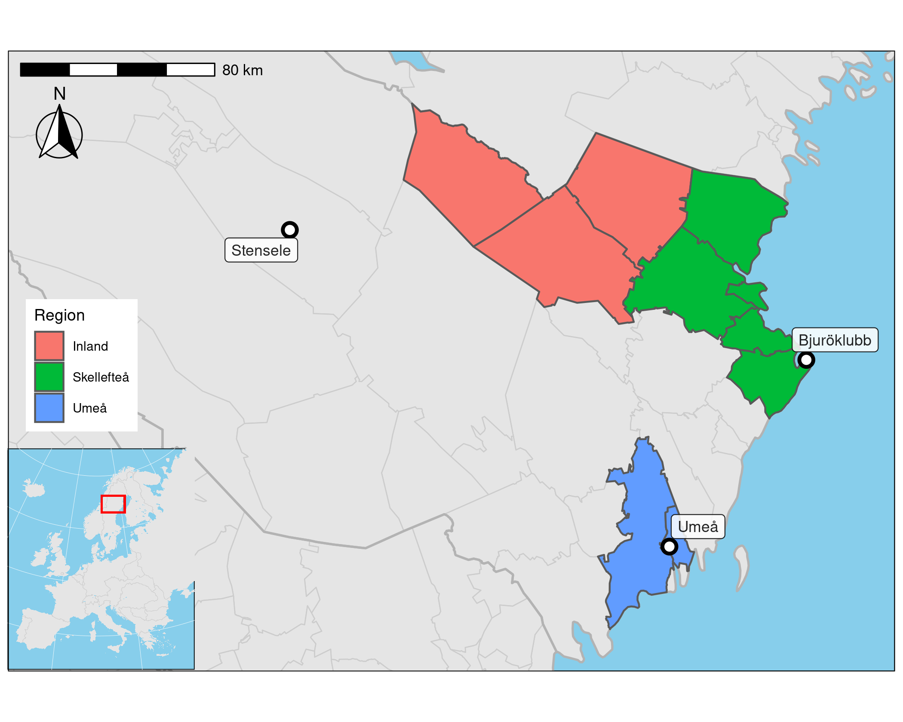

```{r setup, include=FALSE}
knitr::opts_chunk$set(echo = FALSE, fig.path='figs/',fig.height=3, comment=NA) ## NOTE!!
knitr::opts_knit$set(global.par = TRUE)
##
library(knitr)
library(eha)
starttid <- proc.time()
```

```{r setpar}
par(las = 1, cex.axis = 0.8, cex.lab = 0.8, cex = 0.8)
```

```{r readdata}
births <- readRDS("data/births4.rds")
infdat <- readRDS("data/infdat4.rds")
infdat$marginTemp <- round(infdat$extemp.1)
infdat$expTemp <- round(infdat$emeantemp.1)
```
# Introduction

The impact of ambient temperature variations on infant mortality is studied for 
two northern Sweden areas, the Umeå coastal region and Skellefteå coastal and inland regions, during the 
first half of the twentieth century. Two recent papers [@junkka; @karlsson] studied 
neonatal mortality and temperature variations in this geographical area during the 
years 1880--1950.
@rock2014 studies associations between temperature and age-stratified mortality,
Skellefteå 1749--1859. Effects of temperature on mortality in general is a research area that has generated great interest over the last years, partly due to new weather conditions related to climate change.

In our previous study, we analysed the role of climate for mortality in different ages in southern Sweden 1766--1860 combining time-series data on temperature and longitudinal individual level data
[@tbgb10]. We found that low winter temperatures led to an increase in mortality among adults but not children in ages 1-15 years [@tbgb10]. To understand how hard winters and warm summers affected different parts of the population, we used methods similar to the ones we have developed for our analyses of the impact of food prices. This means that the focus was on annual variations on temperature and mortality. The main focus was on demographic vulnerability to changes in external factors, such as food process and temperature, as a measurement of living standards. Well-off groups could afford buying food and firewood even of prices went up, while those living close to their margins suffered to such an extent that family members might die [@tb04]. Still, child mortality was fairly equal between social classes until the latter part of the nineteenth century to widen in the beginning of the twentieth century, for both post-neonatal infant and child mortality [@dk21]. For neonatal mortality, no systematic class differences existed in any period. While infant was equal between social classes up until the end of the nineteenth century, it differed between urban and rural areas. In fact, in 1850, infant mortality in urban areas was 50 percent higher than in rural areas and it was not until the 1920s that mortality rates converged [@scb69].

Periods with low temperature might not only cause problems of keeping body heat, indoors and outdoors, but also lead to an increase in the spread of virus. The reason is that low temperature is associated with low humidity. A study of England and Wales in 1921--27, for example, shows the close connections between seasonality in temperature, humidity, and diagnosed cases of smallpox, which was a mild disease by then [@rl28]. This means that you are more likely to be infected by viral diseases, such as measles, whooping-cough, and influenza, in low temperatures. Since the outcome of such diseases are not dependent on the nutritional status of the host [@rr83], we anticipate that they will not have a social gradient. Other diseases that are nutritionally dependent, such as pneumonia, TB, and gastro-intestinal diseases, might, however, have such a gradient. It means that low winter temperatures might give rise to a social gradient in mortality, but it may as well be socially neutral.

In this study, we differentiate between neonatal and postneonatal mortality in an effort to understand the role of resources to protect infants rom both normal and extreme ambient temperatures. We analyse the effects of seasonal variation and the occurrence of extreme weekly temperatures and its interaction with social class and time period. Analyses are performed separately for neonatal and post neonatal mortality, and for winter and summer seasons. The reason is that mortality in the first four weeks of life is associate with different factors than mortality later in infancy. For this reason, Bourgeois-Pichat differentiate between endogenous and exogenous factors, arguing that mortality shortly after birth is due to the maternal health, fetal factors, and the delivery itself, whereas it afterwards is due to exposure to external factors following the birth-weight development [@bp51a;@bp51b]. The main question is to what extent temperature, directly or indirectly via humidity, affect the survival of infants and to what extent it depends on the resources of the family. 


Figure \@ref(fig:map) shows the study area within Sweden, with the weather stations 
marked. The map is taken (with permission) from the paper by @junkka.

```{r map, fig.height = 5, fig.cap = "Umeå, Skellefteå (orange) and its inland (green)."}

```


# Data

We have two sources of data which we combine into one data set suitable for our purpose.
The first is demographic data obtained from the 
*Centre for Demographic and Ageing Research* (CEDAR, https://cedar.umu.se),
the second is daily temperature measurements obtained from the 
*Swedish Meteorological and Hydrological Institute* (SMHI, https://www.smhi.se). 

## Infant mortality

Individual data with all births between 1 January 1895 and 31 December 1950 in two 
coastal and one inland areas of north Sweden, Skellefteå (51560 births) and Umeå (31213 births).
They were followed until death or age one year, whichever came first. 
The following *static* characteristics were observed on each child:

**birthdate** Date of birth. 

**sex** Girl or boy.

**exit** Number of days under observation.

**event** Logical, *TRUE* if a death is observed.

**socBranch** Working branch of father (if any).

**socStatus** Social status *within* the given working branch.

**illeg** Mother unmarried?

**parity** Order among siblings.

Some crude statistics about infant, neonatal, and postneonatal mortality are shown in 
Figures.

Figure \@ref(fig:mortstat) shows the average weekly crude infant mortality, and a clear seasonal pattern is visible.

```{r mortstat, fig.cap = "Crude infant mortality by week of year, Umeå/Skellefteå 1895--1950.", fig.height = 3, cache = TRUE}
##infdat <- readRDS("data/infdat4.rds") Already done
tid <- toTpch(Surv(enter, exit, event) ~ week, data = infdat, cuts = c(0, 1))
y <- tid$event / tid$exposure
par(las = 1, cex.axis = 0.7, cex.lab = 0.7)
plot(1:52, y, type = "b", col = "blue", axes = FALSE, ylim = c(0, max(y)),
     xlab = "Week", ylab = "O/E rate", cex = 0.7, lwd = 1.5)
axis(1, at = c(1, 10, 20, 30, 40, 52))
axis(2, las = 1, at = c(0, 0.03, 0.06, 0.09))
abline(h = c(0.05, 0.07, 0.09, 0.11), lty = 3)
abline(h = 0)
box()
```

The average weekly neonatal mortality is shown in Figure \@ref(fig:neodata).

```{r neodata, fig.cap = "Crude neonatal mortality by week of year, Umeå/Skellefteå 1895--1950.", fig.height = 3, cache = TRUE}
neo <- age.window(infdat, c(0, 28 / 365))
tneo <- toTpch(Surv(enter, exit, event) ~ week, data = neo, cuts = c(0, 28 / 365))
y <- tneo$event / tneo$exposure
par(cex.axis = 0.7)
par(las = 1, cex.axis = 0.7, cex.lab = 0.7)
plot(1:52, y, type = "b", col = "blue", axes = FALSE, ylim = c(0, max(y)),
     xlab = "Week", ylab = "O/E rate", cex = 0.7, lwd = 1.5)
axis(1, at = c(1, 10, 20, 30, 40, 52))
axis(2, las = 1, at = c(0, 0.2, 0.4, 0.6))
abline(h = c(0.3, 0.4, 0.5, 0.6), lty = 3)
abline(h = 0)
box()
```

The seasonal pattern is similar to the one we found above for infant mortality.

The average weekly postneonatal mortality is shown in Figure \@ref(fig:pneodata).

```{r pneodata, fig.cap="Crude postneonatal mortality by week of year, cache=FALSE, Umeå/Skellefteå 1895--1950.", fig.height=3}
pneo <- age.window(infdat, c(28 / 365, 1))
tpneo <- toTpch(Surv(enter, exit, event) ~ week, data = pneo, cuts = c(28 / 365, 1))
y <- tpneo$event / tpneo$exposure
par(las = 1, cex.axis = 0.7, cex.lab = 0.7)
plot(1:52, y, type = "b", col = "blue", axes = FALSE, ylim = c(0, max(y)),
     xlab = "Week", ylab = "O/E rate", cex = 0.7, lwd = 1.5)
axis(1, at = c(1, 10, 20, 30, 40, 52))
axis(2, at = c(0, 0.02, 0.04, 0.06), las = 1)
abline(h = c(0.03, 0.04, 0.05, 0.06, 0.07), lty = 3)
abline(h = 0)
box()
```

The seasonal pattern is once again similar to the one we found for infant mortality.
Next, the decline over the years in Figures \@ref(fig:longtrend) and \@ref(fig:ntrend).

```{r longtrend, fig.cap = "Crude IMR by year, Umeå-Skellefteå 1895--1950.", fig.height = 3, cache = TRUE}
trend <- toTpch(Surv(enter, exit, event) ~ year, data = infdat, cuts = c(0, 1))
y <- trend$event / trend$exposure
par(las = 1)
par(las = 1, cex.axis = 0.7, cex.lab = 0.7)
plot(1895:1951, y, type = "b", col = "blue", ylim = c(0, max(y)), xlab = "Year",
     ylab = "O/E rate", lwd = 1.5, cex = 0.7)
abline(h = c(0.05, 0.1, 0.15), lty = 3)
abline(h = 0)
```


```{r ntrend, fig.cap = "Crude NMR by year, Umeå-Skellefteå 1895--1950.", fig.height = 3, cache = TRUE}
ndat <- age.window(infdat, c(0, 28 / 365))
tnda <- toTpch(Surv(enter, exit, event) ~ year, data = ndat, cuts = c(0, 28 / 365))
y <- tnda$event / tnda$exposure
par(las = 1)
par(las = 1, cex.axis = 0.7, cex.lab = 0.7)
plot(1895:1951, y, type = "b", col = "blue", ylim = c(0, max(y)), xlab = "Year",
     ylab = "O/E rate", lwd = 1.5, cex = 0.7)
abline(h = 0)
abline(h = c(0.2, 0.4, 0.6), lty = 3)
```

```{r pntrend, fig.cap = "Crude postneonatal mortality by year, Umeå-Skellefteå 1895--1950.", fig.height = 3, cache = TRUE}
pndat <- age.window(infdat, c(28 / 365, 1))
tpnda <- toTpch(Surv(enter, exit, event) ~ year, data = pndat, 
                cuts = c(28 / 365, 1))
y <- tpnda$event / tpnda$exposure
par(las = 1)
par(las = 1, cex.axis = 0.7, cex.lab = 0.7)
plot(1895:1951, y, type = "b", col = "blue", ylim = c(0, max(y)), xlab = "Year",
     ylab = "O/E rate", lwd = 1.5, cex = 0.7)
abline(h = 0)
abline(h = c(0.2, 0.4, 0.6), lty = 3)
```

Note that the estimates of neonatal and postneonatal mortality are non-standard here: 
They are calculated as *occurrence-exposure rates*, that is, the number of deaths
divided by *exposure time*. They are thus crude *hazard rates*, not probabilities, which is 
more common in definitions of mortality.

## Temperature

```{r readtemp}
umetemp <- readRDS("data/umetemp.rds")
bjurtemp <- readRDS("data/bjurtemp.rds")
stentemp <- readRDS("data/stentemp.rds")
```

Temperature data are collected from three weather stations, *Umeå*, *Bjuröklubb*
(used with population data from Skellefteå coastal area), and *Stensele* (Inland). All stations deliver
daily temperature data covering our time period, usually three measures per day, morning,
noon, and evening. In Table \@ref(tab:typweek), the Umeå data from the week 1--7 January,
1923 is shown.

```{r typweek}
tum <- read.table("~/Forskning/Data/ume_temp.csv", skip = 10, sep = ";", header = TRUE)
source("R/tbl.R")
ww <- tum[70137:(70137 + 20), ]
names(ww) <- c("Date", "Time", "Temperature", "Quality")
tbl(ww, caption = "Raw temperature data from first week of 1923, Umeå.", fs = 10,
    linesep = c("", "", "\\addlinespace"))
```

There are three measurements per day, or 21 per week. In the forthcoming analyses,
the weekly data are summarized in a few measurements, see Table \@ref(tab:cond).
Our rule for week numbering is that week No. 1 always start on January 1. Week No. 52
 always ends at December 31, and so will be eight days long, except for leap years, when
 it will be nine days long.
 
```{r cond}
sh <- umetemp[umetemp$year == 1923 & umetemp$week == 1, ]
tbl(round(sh[, 1:8], 2), caption = "Weekly summarized temperature data: Umeå 1923, first week.", fs = 9)
```

Weekly averages (`mintemp`, `maxtemp`, `meantemp`)  are calculated by week and year, and deviations from 
the averages (`emintemp`, `emaxtemp`, `emeantemp`) of the weekly averages are used as time-varying *communal covariates*. 
As an example, see Figure \@ref(fig:firstweek), where the variation around the average
minimum temperature (`emintemp`) week 1 is shown. 

```{r firstweek, fig.cap = "Minimum temperature the first week of each year.", fig.height = 3}
w1 <- umetemp[umetemp$week == 1, ]
emintemp <- w1$emintemp[1]
mintemp <- w1$mintemp
par(las = 1, cex.axis = 0.7, cex.lab = 0.7)
plot(w1$year, mintemp, type = "b", lty = 2, col = "blue", xlab = "Year", ylab = "Temperature", 
     axes = FALSE, ylim = c(-35, 0), cex = 0.7)
axis(1, at = c(1894, 1903, 1913, 1923, 1932, 1942, 1951))
whh <- c(-30, -25, emintemp, -10, 0) 
axis(2, at = whh, labels = round(whh))
abline(h = emintemp, lwd = 1.5, col = "blue")
abline (h = 0)
abline(v = 1923, lty = 3)
box()
```

Curiously, our randomly selected year 1923 turns out contain the warmest first week of all years, see 
Figure \@ref(fig:firstweek). 

Figure 
\@ref(fig:monavgtemp) shows the average monthly distribution over all years. The subregional patterns 
and levels are very similar.

```{r monavgtemp, fig.cap="Weekly max, mean, and min temperature averages, 1895--1950.", fig.height = 3, cache = TRUE}
oldpar <- par(mfrow = c(1, 3))
## Umeå:
umaxavg <- umetemp$emaxtemp[1:52]
uminavg <- umetemp$emintemp[1:52]
umeanavg <- umetemp$emeantemp[1:52]
##par(las = 1, cex.axis = 0.7, cex.lab = 0.7)
plot(1:52, umaxavg, ylim = c(-30, 30), type = "b", col = "red", axes = FALSE,
     xlab = "Week", ylab = "Temperature (C)", cex = 0.6, lwd = 0.7)
text(17, 27, "Umeå", cex = 0.7)
axis(1, at = c(1, 10, 29, 43, 52))
m12 <- c(-30, -15, 0, 14.5, 25)
axis(2, las = 1, at = m12)
abline(h = 0)
abline(v = 29, lty = 3)
abline(h = m12, lty = 3)
lines(1:52, uminavg, type = "b", col = "blue", cex = 0.6, lwd = 0.7)
lines(1:52, umeanavg, type = "l", col = "black", cex = 0.6, lwd = 0.8)
text(8, 11, "max", col = "red", cex = 0.7)
text(20, -9, "min", col = "blue", cex = 0.7)
box()
## Skellefteå:
bmaxavg <- bjurtemp$emaxtemp[1:52]
bminavg <- bjurtemp$emintemp[1:52]
bmeanavg <- bjurtemp$emeantemp[1:52]
plot(1:52, bmaxavg, ylim = c(-30, 30), type = "b", col = "red", axes = FALSE,
     xlab = "Week", ylab = "Temperature (C)", cex = 0.6, lwd = 0.7)
text(17, 27, "Skellefteå", cex = 0.7)
axis(1, at = c(1, 10, 29, 43, 52))
axis(2, las = 1, at = m12)
abline(h = 0)
abline(v = 29, lty = 3)
abline(h = m12, lty = 3)
lines(1:52, bminavg, type = "b", col = "blue", cex = 0.6, lwd = 0.7)
lines(1:52, bmeanavg, type = "l", col = "black", cex = 0.6, lwd = 0.8)
text(8, 11, "max", col = "red", cex = 0.7)
text(20, -9, "min", col = "blue", cex = 0.7)
box()
##
## Inland:
bmaxavg <- stentemp$emaxtemp[1:52]
bminavg <- stentemp$emintemp[1:52]
bmeanavg <- stentemp$emeantemp[1:52]
plot(1:52, bmaxavg, ylim = c(-30, 30), type = "b", col = "red", axes = FALSE,
     xlab = "Week", ylab = "Temperature (C)", cex = 0.6, lwd = 0.7)
text(17, 27, "Inland", cex = 0.7)
axis(1, at = c(1, 10, 29, 43, 52))
axis(2, las = 1, at = m12)
abline(h = 0)
abline(v = 29, lty = 3)
abline(h = m12, lty = 3)
lines(1:52, bminavg, type = "b", col = "blue", cex = 0.6, lwd = 0.7)
lines(1:52, bmeanavg, type = "l", col = "black", cex = 0.6, lwd = 0.8)
text(8, 11, "max", col = "red", cex = 0.7)
text(20, -9, "min", col = "blue", cex = 0.7)
box()
##
par(oldpar)
```

Time trends of yearly average temperatures, see Figure \@ref(fig:longterm).

```{r longterm, fig.cap = "Yearly average temperatures, Umeå and Skellefteå.", cache = TRUE}
bmtemp <- rbind(umetemp, bjurtemp, stentemp)
umt <- with(bmtemp, tapply(meantemp, year, mean))
par(las = 1)
par(las = 1, cex.axis = 0.7, cex.lab = 0.7)
plot(1894:1951, umt, type = "b", col = "blue", xlab = "Year",
     ylab = "Mean temperature", lwd = 1.5, cex = 0.7, ylim = c(0, 7))
abline(h = 0)
abline(h = 1:6, lty = 3)
```

## Temperature as communal covariates

The two data sets, mortality and weather, are combined into one by treating temperature data 
as a communal covariate and incorporate it as such in the mortality data set. The 
function *make.communal* in the **R** [@cran] package *eha* [@eha; @ehar2] is used 
for that purpose.  Resulting data frame is partly shown in Table \@ref(tab:readdata3).

```{r readdata3}
levels(infdat$subreg) <- c("ume", "ske", "inland")
##infdat$excessTemp <- cut(infdat$extemp, c(-16, -2, 2, 9), include.lowest = TRUE) # NOTE!!!
##infdat$excessTemp <- relevel(infdat$excessTemp, ref = "(-2,2]")
##infdat$lowTemp <- (infdat$extemp + infdat$extemp.1) < -10  # CHECK THIS!!
##infdat$highTemp <- infdat$extemp + infdat$extemp.1 > 10
##infdat$lowTemp <- with(infdat, (extemp < -3) & (extemp.1 < -3))
infdat$lowTemp <- (with(infdat, cold + cold.1 < -10))
infdat$highTemp <- with(infdat, (extemp > 3) & (extemp.1 > 3))
##infdat$weather <- infdat$extemp.1
##infdat$climate <- round(infdat$emeantemp)
tbl(head(infdat[, c("enter", "exit", "event", "marginTemp", "expTemp", "week", "year")]),
    caption = "Data with communal covariates.", fs = 11)
```

We will use the temperature variables *meantemp* and *emeantemp* under the names *marginTemp* 
and *expTemp*, respectively, lagged one week. That is, we assume that the effect of 
temperatures on mortality show itself the following week.

# Statistical modelling

It turns out that extremely low temperature is bad during all seasons,
and extremely high temperature is bad during summer, but good otherwise.
So we group season into two categories, *summer* and *winter*.
In each case separate analyses for neonatal and postneonatal mortality are performed. 

The *summer* half-year consists of the weeks 14--39, about 1 April to 30 September, and the *winter*
half-year is the rest, weeks 1-13 and 40--52, 1 January to 31 March and 1 October to 31 December.
This is the division made in @karlsson, and we keep it for comparability reasons.

```{r prepare}
source("R/ltx2.R")
infdat$parity <- cut(infdat$parity, c(-2, 1.5, 4.5, 19), labels = c("1", "2-4", "5+"))
##infdat$period <- cut(infdat$birthdate, c(1895, 1914, 1935, 1951), dig.lab = 5)
##levels(infdat$subreg) <- c("ume", "ske")
##infdat$season <- cut(infdat$week, c(-1, 9.5, 22.5, 35.5, 48.5, 52.5), labels = c("winter", "spring", "summer", "fall", "winter"))
##infdat$season <- as.factor(infdat$season)
## New:
infdat$summer <- infdat$week %in% 14:39
##infdat$eexpTemp <- round(infdat$emeantemp)
```

## Variables

These are the covariates considered in our analyses. Central are the two first, 
already discussed, but of interest is also their effect (on mortality) covariation,
primarily with *social status* (`socst`).

*   **expTemp** (time varying) expected temperature given week number.
*   **marginTemp** (time varying) Observed week temperature minus expTemp.
*   **socst** Social status:
     + *highWhiteC* Upper white collar
     + *farmer*
     + *lowWhiteC* Lower white collar
     + *qualWorker* Qualified worker
     + *worker* Unqualified worker
     + *none* No notation (for instance unmarried mother)
*   **sex** Boy or girl
*   **urban** Small town (Umeå or Skellefteå) or not (logical)
*   **parity** Birth order
*   **year**  (time varying)

Comments on other candidate covariates: 
*Birth month* is left out in the analyses despite that fact that
it is an important factor in neonatal mortality. However, we include *time of year* in terms of 
*winter* and *summer* as a time-varying covariate, and in the neonatal case it will coincide to a
great extent with birth period. For the postneonal case the situation is different, but it turns out that
for those infants who have survived the first month of life, birth month does not matter much.
We separate the investigation into two parts, *neonatal* and *postneonatal* mortality. But first,
a joint analysis.

 We have information on whether the infant was *illegitimate* (mother unmarried);
those cases are incorporated in the category *none* of **socst**.

# Results

The results regarding neonatal mortality is much in accordance with the results
found by @junkka. However, they used temperature in a "hockey-stick" regression with a breakpoint at
14.5 degrees Celsius and a negative slope (decreasing risk) to the left and a positive slope
(increasing risk) to the right. Instead, we are using the average weekly temperature
for the 52 weeks of a year, for each week averaging over all the years in the study, as
our "reference points" ("expTemp"), adding deviances up and down ("marginTemp") as
"short-term temperature stress". This is similar to the way prices and mortality were related
in for instance @genus11, that is, a time series split into long time trend and short
term variation.


```{r managedata}
neo <- age.window(infdat, c(0, 28 / 365))
 pneo <- age.window(infdat, c(28/365, 1))
```

```{r nonenow, eval=FALSE}
if (!(file.exists("data/inftab.rds") && file.exists("data/tabneo.rds") && file.exists("data/tabpost.rds"))){

    neo$ageIvl <- "neo"
    
    pneo$ageIvl <- "postneo"
    all <- rbind(neo, pneo)
    all$ageIvl <- factor(all$ageIvl)
    ##all$enter <- round(all$enter * 365)
    ##all$exit <- round(all$exit * 365)
    ##fit.all <- coxph(Surv(enter, exit, event) ~ strata(ageIvl) * (extemp + emeantemp + lowTemp + highTemp + socBranch + ##socStatus + sex + period),
    ##               data = all)
    ##dr.all <- drop1(fit.all, test = "Chisq")
    
    inftab <- toTpch(Surv(enter, exit, event) ~ subreg + sex + period + socst + urban + parity +  marginTemp + expTemp + summer + ageIvl, data = all,
                     cuts = c(0, 3, 7, 14, 28, 56, 84, 145, 207, 286, 365) / 365)
    tabneo <- inftab[inftab$ageIvl == "neo", ]
    tabpost <- inftab[inftab$ageIvl == "postneo", ]
    tabpost$age <- factor(tabpost$age)
    tabneo$age <- factor(tabneo$age)
    saveRDS(tabneo, file = "data/tabneo.rds")
    saveRDS(tabpost, file = "data/tabpost.rds")
    saveRDS(inftab, file = "data/inftab.rds")
}else{
    inftab <- readRDS("data/inftab.rds") #The rest are read later...
}
```

```{r joint, cache=FALSE}
if (!file.exists("Rdata/dr.all.rds")){
    fit.all <- tpchreg(oe(event, exposure) ~  strata(ageIvl) * 
                           (extemp.1 + emeantemp.1 + socst + period + urban), 
                       data = inftab, time = age)
    dr.all <- drop1(fit.all, test = "Chisq")
    saveRDS(dr.all, file = "Rdata/dr.all.rds")
}
##system.time(tabneo.fit <- tpchreg(oe(event, exposure) ~ extemp + emeantemp + highTemp + lowTemp + socst, 
  ##               data = tabneo, time = age))
##system.time(tabpost.fit <- tpchreg(oe(event, exposure) ~ extemp + emeantemp + highTemp + lowTemp + socst, 
  ##               data = tabpost, time = age))
```

Covariates may affect neonatal and postneonatal mortality differently, and one way to 
investigate that is to stratify the infant mortality data into two age intervals, one from
birth to one month of age and the other from one month to one year of age. Then the
interaction between the stratum variable and other variables of interest is investigated, 
with the result shown in Table \@ref(tab:shownonprop).

```{r shownonprop, cache = FALSE, results='asis'}
dr.all <- readRDS("Rdata/dr.all.rds")
rownames(dr.all)[2] <- "strata(ageIvl):marginTemp"
rownames(dr.all)[3] <- "strata(ageIvl):expTemp"

tbl(round(dr.all, 4), caption = "Proportionality tests, neonatal vs. postneonatal.", rownames = TRUE)
```

We can see that the variables *expTemp*, *socst* and *period* all have different effects 
on mortality in the neonatal case compared to the postneonatal case. In terms of 
*infant mortality*, we can say that these covariates have *strong non-proportional* effects.
The response to *marginTemp* variations are probably also different in the neonatal and 
postneonatal periods ($p$-value = 0.09).

Figure \@ref(fig:ph) shows the crude infant mortality, calculated over the complete sample.

```{r ph, fig.cap = "Crude infant mortality."}
##daycuts <- c(0, 3, 7, 14, 28, 56, 84, 145, 207, 286, 365)
##daycuts <- c(0, 3, 7, 28, 56, 140, 183, 250, 365)
b1 <- births
b1$enter <- b1$enter / 365
b1$exit <- b1$exit / 365
daycuts <- c(seq(0, 28, by = 2), seq(49, 245, by = 28), 285, 324, 365)
bb <- toTpch(Surv(enter, exit, event) ~ 1, data = b1, cuts = daycuts / 365)
fit.ph1 <- tpchreg(oe(event, exposure) ~ 1, data = bb, time = age)
plot(fit.ph1, fn = "haz", axes = FALSE, xlab = "Days", main = "", lwd = 1.5, col = "blue")
dax <- c(0, 28, 91, 183, 365)
axis(1, at = dax / 365, labels = dax)
axis(2, las = 1)
box()
abline(v = 28 / 365, lty = 3)
abline( h = 0, v = 0)
```

A calmer development for the postneonatal mortality, see Figure \@ref(fig:phneo).

```{r phneo, fig.cap = "Crude postneonatal mortality."}
b2 <- age.window(b1, c(28 / 365, 1))
pcuts <- c(28, seq(49, 245, by = 28), 285, 324, 365)
tp <- toTpch(Surv(enter, exit, event) ~ 1, data = b2, cuts = pcuts / 365)

fit.ph <- tpchreg(oe(event, exposure) ~ 1, data = tp, time = age)
plot(fit.ph, fn = "haz", axes = FALSE, xlab = "Days", main = "", lwd = 1.5, col = "blue")
axis(1, at = pcuts / 365, labels = pcuts)
axis(2, las = 1)
box()
##abline(v = 28 / 365, lty = 3)
abline( h = 0, v = 0)
```

Figure \@ref(fig:phneo) suggests that some smooth parametric model could fit well,
for instance the *left truncated Weibull*  distribution. Let's see (Figure \@ref(fig:weib)).

```{r weib, fig.cap = "A perfect Weibull hazard fit."}
##births <- readRDS("data/births4.rds")
postbirths <- age.window(births, c(28, 365))
postbirths$exit <- postbirths$exit / 365
postbirths$enter <- postbirths$enter / 365
fit <- phreg(Surv(enter, exit, event) ~ 1, data = postbirths)
plot(fit, fn = "haz", lwd = 1.5, col = "blue", main = "", xlab = "Days", axes = FALSE)
axis(1, at = dax / 365, labels = dax)
axis(2, las = 1)
abline(h = 0, v = 28 / 365)
box()
hh <- hazards(fit.ph, cum = FALSE)
lines(hh$x, hh$y, col = "red")
legend("topright", legend = c("Truncated Weibull", "Piecewise constant"), col = c("blue", "red"), lwd = c(1.5,1))
```

A perfect fit!

In the following we split the analyses into the neonatal and the postneonatal periods, with
a focus on the latter. But we start with a short comment on the link to *biometric* analysis
à la @bp51a.

## The biometric finding

What happens if we extend the truncated Weibull back into neonatal territory? The answer
is given in Figure \@ref(fig:neowei).

```{r neowei, fig.cap = "Weibull hazard functions, total and exogenous neonatal mortality.", fig.height = 4}
b3 <- age.window(b1, c(0, 28 / 365))
fit.w0 <- phreg(Surv(enter, exit, event) ~ 1, data = b3)
plot(fit.w0, fn = "haz", axes = FALSE, xlab = "Days", main = "", lwd = 1.5, col = "red", ylim = c(0, 3))
#fit.ph <- tpchreg(oe(event, exposure) ~ 1, data = inftab, time = age)
##plot(fit.ph1, fn = "haz", axes = FALSE, xlab = "Days", main = "", lwd = 1.5, col = "red",
  ##   xlim = c(0, 28 / 365))
dor <- seq(0, 28, by = 2)
axis(1, at = dor / 365, labels = dor)
axis(2, las = 1)
box()
##abline(v = 28 / 365, lty = 3)
abline( h = 0, v = 0)
pars <- exp(fit$coefficients)
x <- seq(0, 28/365, length = 1000)
y <- hweibull(x, shape = pars[2], scale = pars[1])
lines(x, y, col = "blue", lwd = 1.5)
legend("topright", legend = c("Weibull postneonatal (exogenous), extrapolated", "Weibull neonatal (total)"), col = c("blue", "red"), lwd = c(1.5, 1))
```

Not very good fit in this territory. The difference here is that to the exogenous mortality, endogenous mortality is added.
The difference between the piecewise constant and the Weibull in the figure would be 
called the *endogeneous infant mortality* [@bp51a; @bp51b].

## Neonatal mortality

The neonatal mortality in our geographical area and time period is thoroughly analysed
in two papers by @karlsson and @junkka and we only present a brief confirmatory analysis.

No strong signs of interactions with marginTemp and expTemp data, so these factors strike
almost evenly over different subpopulations. Moreover, the effects are stronger during winter,
with a decrease in mortality for each degree temperature increase, almost the same amount 
for both, around 1.2 per cent. 

Separate analyses for winter and summer, see Tables \@ref(tab:neowinter) and 
\@ref(tab:neosummer) follow. 

### Winter

```{r neowinter, results = "asis"}
##neo$marginTemp <- neo$extemp.1
##neo$expTemp <- neo$emeantemp.1
fit.neow <- coxreg(Surv(enter, exit, event) ~ expTemp + marginTemp + socst + 
                      sex + urban + parity + I(year - 1920),
                  data = neo[!neo$summer, ])
drw <- drop1(fit.neow, test = "Chisq")
ltx(fit.neow, dr = drw, caption = "Neonatal mortality, winter.", label = "tab:neowinter")
```

The result of a Cox regression of neonatal mortality during winter is shown in Table \@ref(tab:neowinter).
There is a (statistically) strong effect of *expTemp*, an increase of the expected temperature
lowers neonatal mortality by around 1.3 per cent per degree. Almost the same effect is shown for *marginTemp*.

The interaction between social status and expTemp is shown in Figure \@ref(fig:plotwcsn). Nothing interesting is
going on, the effect of expTemp on neonatal mortality is the same in all social classes ("no interaction" between
expTemp and socst).

```{r plotwcsn, fig.cap = "Socioeconomic status and expTemp, winter. Neonatal mortality.", fig.height = 3}
source("R/socfig.R")
winter <- neo[!neo$summer, ]
fitw <- coxreg(Surv(enter, exit, event) ~ socst:expTemp + socst, data = winter)
fitw0 <- coxreg(Surv(enter, exit, event) ~ socst + expTemp, data = winter)
p <- anova(fitw, fitw0)[[4]][2]
rang <- range(winter$expTemp)
socfig(coef(fitw), main = "", pval = p, ran = rang, ymax = 4)
```


The interaction between social status and marginTemp is shown in Figure \@ref(fig:plotwwsn). A little
bit more action here, but the conclusion stays the same: No interaction between marginTemp and social class,
bad marginTemp hits all by the same strength. 

```{r plotwwsn, fig.cap = "Socioeconomic status and marginTemp, winter. Neonatal mortality.", fig.height = 3}
source("R/socfig.R")
fitww <- coxreg(Surv(enter, exit, event) ~ socst:marginTemp + socst, data = winter)
fitww0 <- coxreg(Surv(enter, exit, event) ~ socst + marginTemp, data = winter)
p <- anova(fitww, fitww0)[[4]][2]
rang <- range(winter$marginTemp)
socfig(coef(fitww), main = "", pval = p, ran = rang, ymax = 4)
```

### Summer

The summer result of a Cox regression is shown in Table \@ref(tab:neosummer).
Compared to winter, the *expTemp* effect is in the same direction but weaker, while 
the effect of *marginTemp* is zero.

```{r neosummer, results = "asis"}
##neo$marginTemp <- neo$extemp.1
##neo$expTemp <- neo$emeantemp.1
fit.neos <- coxreg(Surv(enter, exit, event) ~ expTemp + marginTemp + socst + 
                      sex + urban + parity + I(year - 1920),
                  data = neo[neo$summer, ])
##data = neo[neo$week %in% 20:32, ])
drs <- drop1(fit.neos, test = "Chisq")
ltx(fit.neos, dr = drs, caption = "Neonatal mortality, summer.", label = "tab:neosummer")
```


During summer, expTemp and marginTemp effects are clearly smaller, and regarding marginTemp, the opposite 
direction: Excess heat increases the death risk, however not very much and not statistically significant. 

The interaction between social status and *expTemp* is shown in Figure \@ref(fig:plotscsn). 
Nothing of interest is going on.

```{r plotscsn, fig.cap = "Socioeconomic status and expTemp, summer. Neonatal mortality.", fig.height = 3}
source("R/socfig.R")
summer <- neo[neo$summer, ]
fits <- coxreg(Surv(enter, exit, event) ~ socst:expTemp + socst, data = summer)
fits0 <- coxreg(Surv(enter, exit, event) ~ socst + expTemp, data = summer)
p <- anova(fits, fits0)[[4]][2]
rang <- range(summer$expTemp)
socfig(coef(fits), main = "", pval = p, ran = rang, ymax = 4)
```

The interaction between social status and *marginTemp* is shown in Figure \@ref(fig:plotswsn). The same conclusion as 
for *expTemp*, nothing of interest shows up.

```{r plotswsn, fig.cap = "Socioeconomic status and marginTemp, summer. Neonatal mortality.", fig.height = 3}
source("R/socfig.R")
fitsw <- coxreg(Surv(enter, exit, event) ~ socst:marginTemp + socst, data = summer)
fitsw0 <- coxreg(Surv(enter, exit, event) ~ socst + marginTemp, data = summer)
p <- anova(fitsw, fitsw0)[[4]][2]
rang <- range(summer$marginTemp)
socfig(coef(fitsw), main = "", pval = p, ran = rang, ymax = 4)
```


## Postneonatal mortality

```{r setformw}
form <- as.formula("oe(event, exposure) ~ socst + extemp.1 + eexpTemp.1 + urban + subreg + sex + parity")

formex1 <- as.formula("oe(event, exposure) ~ socst + socst:extemp.1 + eexpTemp.1 + urban + subreg + sex + parity")
formem <- as.formula("oe(event, exposure) ~ socst + socst:eexpTemp.1 + extemp.1 + urban + subreg + sex + parity")
form.sb <-  as.formula("oe(event, exposure) ~ extemp.1 * socst + urban + subreg + sex + parity")
form.sr <- as.formula("oe(event, exposure) ~ (extemp.1 + eexpTemp.1) * subreg + socst + urban + sex + parity") 
tabpost <- readRDS("data/tabpost.rds")
```

### Winter

See Table \@ref(tab:allpneo) for winter results. Variation in normal temperature (expTemp) has a large and 
statistically significant effect on postneonatal mortality. The same goes for the marginal 
temperature effect, however not so pregnant as fot the expTemp.

```{r allpneo, results = "asis", cache = TRUE}
##pneo$expTemp <- pneo$eexpTemp.1
##pneo$marginTemp <- pneo$extemp.1
winter <- pneo[!pneo$summer, ]
fit.pneo <- coxreg(Surv(enter, exit, event) ~ expTemp + marginTemp + sex + socst +
                        urban + parity + I(year - 1920), data = winter)
dr <- drop1(fit.pneo, test = "Chisq")
ltx(fit.pneo, dr = dr, caption = "Postneonatal mortality, winter.", label = "tab:allpneo")
```

The interaction between social status and expTemp is shown in Figure \@ref(fig:plotwcs). All except the 
upper white collar have almost the same (negative) slope, the upper class do not have much problem with normal 
temperature variations.

```{r plotwcs, fig.cap = "Socioeconomic status and expTemp, winter. Postneonatal mortality.", fig.height = 3}
source("R/socfig.R")
fitw <- coxreg(Surv(enter, exit, event) ~ socst:expTemp + socst, data = winter)
fitw0 <- coxreg(Surv(enter, exit, event) ~ socst + expTemp, data = winter)
p <- anova(fitw, fitw0)[[4]][2]
rang <- range(winter$expTemp)
socfig(coef(fitw), main = "", pval = p, ran = rang, ymax = 8)
```

The interaction between social status and marginTemp is shown in Figure \@ref(fig:plotwws). Here the situation
is different for the upper class: It follows essentially the same path (on a lower level) as the rest.

```{r plotwws, fig.cap = "Socioeconomic status and marginTemp, winter. Postneonatal mortality.", fig.height = 3}
source("R/socfig.R")
fitww <- coxreg(Surv(enter, exit, event) ~ socst:marginTemp + socst, data = winter)
fitww0 <- coxreg(Surv(enter, exit, event) ~ socst + marginTemp, data = winter)
p <- anova(fitww, fitww0)[[4]][2]
rang <- range(winter$marginTemp)
socfig(coef(fitww), main = "", pval = p, ran = rang, ymax = 8)
```


### Summer

See Table \@ref(tab:allpneos) for summer results. The normal temperature variation 
still has a strong importance, while temporary variations on the margin have a  
slightly lower effect on the postneonatal mortality.

```{r allpneos, results = "asis", cache = TRUE}
summer <- pneo[pneo$summer, ]
fit.pneos <- coxreg(Surv(enter, exit, event) ~ expTemp + marginTemp + sex + socst + urban +
                         parity + I(year - 1920), data = summer)
drs <- drop1(fit.pneos, test = "Chisq")
ltx(fit.pneos, dr = drs, caption = "Postneonatal mortality, summer.", label = "tab:allpneos")
```

The interaction between social status and expTemp is shown in Figure \@ref(fig:plotscs).
The impression is that the upper class suffer more of higher expected temperature (that is, 
the months July and August) than farmers and workers, with lower white collars and qualified workers somwhere in between.

```{r plotscs, fig.cap = "Socioeconomic status and expTemp, summer. Postneonatal mortality.", cache = TRUE, fig.height = 3}
source("R/socfig.R")
fits <- coxreg(Surv(enter, exit, event) ~ socst:expTemp + socst, data = summer)
fits0 <- coxreg(Surv(enter, exit, event) ~ socst + expTemp, data = summer)
p <- anova(fits, fits0)[[4]][2]
rang <- range(summer$expTemp)
socfig(coef(fits), main = "", pval = p, ran = rang, ymax = 8)
```

The interaction between social status and marginTemp is shown in Figure \@ref(fig:plotsws). 
The pattern on the margin very much resembles that of the expected variations. 

```{r plotsws, fig.cap = "Socioeconomic status and marginTemp, summer. Postneonatal mortality.", cache = TRUE, fig.height = 3}
source("R/socfig.R")
fitsw <- coxreg(Surv(enter, exit, event) ~ socst:marginTemp + socst, data = summer)
fitsw0 <- coxreg(Surv(enter, exit, event) ~ socst + marginTemp, data = summer)
p <- anova(fitsw, fitsw0)[[4]][2]
rang <- range(summer$marginTemp)
socfig(coef(fitsw), main = "", pval = p, ran = rang, ymax = 8 )
```


# Conclusion

In this study, we differentiate between neonatal and post-neonatal mortality in an effort to understand the role of resources to protect infants from both normal and extreme ambient temperatures in northern Sweden 1895-1950. Our results show that, like in other parts of Sweden, continuously declining infant mortality. They show that the health penalty if living in a city has disappeared among infants [@scb69]. They also show the typical u-shape mortality pattern of birth-order and higher mortality for boys than girls. The neonatal mortality was about the same for all social groups in the winter and slightly lower for children of higher social classes in the summer. This is much as expected since mortality shortly after birth often is not related to social and economic resources but to specific maternal factors, what Bourgeois-Pichat calls endogenous factors. Still, external factors, such as ambient temperature, affects mortality in first month of life. It is not so much extremely low or high temperatures that are important but the seasonality, the annual variation, in temperature and particularly the low temperature during the winter season. The way temperature affect different social groups are small but slightly larger in extreme weather conditions. 

For postneonatal mortality, we find a similar decline, a u-shaped patter for birth-order, and higher mortality for boys than for girls, as for neonatal mortality. We find much larger social differences in mortality than during the first months of life, similar to what has been found for southern Sweden [@dk21]. In fact, during the summer mortality among children of lower white collar, farmers, and workers are twice as high comparative to children of higher classes.

During the winter, the differences are even larger. The effects of temperature are also much larger and, again, the effect the normal seasonal variation that mattered the most, especially for mortality during the summer season. Thus, postneonatal mortality was much more sensitive than neonatal mortality, both to parental and external factors. The ways that temperature affects different social groups are also much more pronounced than during the first month of life. Summer temperatures have no impact on mortality among children of higher classes, neither normal variation nor extreme situations. Other social groups have higher mortality during cold summer weeks. Turning to the effects of winter temperatures, while the normal seasonally, that is the average weekly temperature, has a strong influence on postneonatal mortality among all other social classes, it has no impact at all on white-collar workers. Extremely cold winters, however, also affects children of white-collar workers. Still, the differences are not statistically significant possibly due to the fact that higher white collar was a small group in this period.

Taken together, we find that postneonatal mortality is far more sensitive both to individual, family, and external factors, such as temperature, than mortality in first month of life. During normal temperature variations, children of higher classes did not suffer from increased mortality, only during extremely cold winters. The fact that children of higher classes do not suffer from increased mortality during normal winter suggests that the effect of low temperature is not due to low humidity, which would affect all classes similarly, but to temperature itself.

# Session info

Used processing time (seconds):

```{r tidtagning}
sluttid <- Sys.time()
proc.time() - starttid
```


Done: `r sluttid`.

