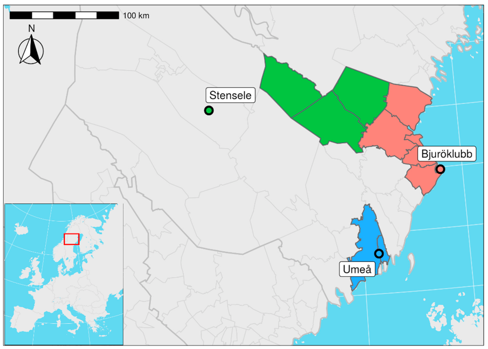

```{r setup, include=FALSE}
knitr::opts_chunk$set(echo = FALSE, fig.path='figs/',fig.height=3, comment=NA)
knitr::opts_knit$set(global.par = TRUE)
##
library(knitr)
library(eha)
##par(las = 1, cex.axis = 0.7, cex.lab = 0.7)
g <- function(x) (log(1 + x))^3 # x in days.
dg <- function(x) (3 * (log(1 + x))^2) / (1 + x)
ginv <- function(y) exp(y^(1/3)) - 1
```

```{r setpar}
par(las = 1, cex.axis = 0.8, cex.lab = 0.8, cex = 0.8)
```


# Introduction

The impact of ambient temperature variations on infant mortality is studied for 
a northern Sweden coastal area, the Umeå and Skellefteå regions, during the 
first half of the twentieth century. Two recent papers [@junkka; @karlsson] studied 
neonatal mortality and temperature variations in a larger geographical area containing 
the present one during the 
years 1880--1950. Climate and mortality in general is a research area that has 
generated great interest over the last years, see @tbgb10.

The effect of seasonal variation and the occurrence of extreme monthly temperatures
is studied and interacted with sex, social class, and legitimacy. Studies are performed 
separately for neonatal  and postneonatal mortality, and for winter and summer seasons, 
and the classification into endogenous and exogenous factors will be discussed.

One important reason for studying neonatal and postneonatal mortality separately is the 
empirical findings by Bourgeois-Pichat [@bp51a;  @bp51b] about endogenous and exogenous 
mortality and the log-cube transform.

Figure \@ref(fig:map) shows the study area within Sweden, with the weather stations 
marked. The map is taken from the paper by @junkka.

```{r map, fig.height = 5, fig.cap = "Umeå, Skellefteå (orange) and its inland (green)."}

```


# Data

We have two sources of data which we combine into one data set suitable for our purpose.
The first is demographic data obtained from the 
*Centre for Demographic and Ageing Research* (CEDAR, https://cedar.umu.se),
the second is daily temperature measurements obtained from the 
*Swedish Meteorological and Hydrological Institute* (SMHI, https://www.smhi.se). 

## Infant mortality

Individual data with all births between 1 January 1895 and 31 December 1950 in two 
coastal areas of north Sweden, Skellefteå (51560 births) and Umeå (31213 births).
They were followed until death or age 365 days, whichever came first. 
The following *static* characteristics were observed on each child:

**birthdate** Date of birth. 

**sex** Girl or boy.

**exit** Number of days under observation.

**event** Logical, *TRUE* if a death is observed.

**socBranch** Working branch of father (if any).

**socStatus** Social status of family, based on HISCLASS.

**illeg** Mother unmarried?

**parity** Order among siblings.

Some crude statistics about infant, neonatal, and postneonatal mortality are shown in 
Figures.

Figure \@ref(fig:mortstat) shows the average monthly crude infant mortality, and a clear seasonal pattern is visible.

```{r mortstat, fig.cap = "Crude infant mortality by week of year, Umeå/Skellefteå 1895--1950.", fig.height = 3}
infdat <- readRDS("data/infdat3.rds")
tid <- toTpch(Surv(enter, exit, event) ~ week, data = infdat, cuts = c(0, 1))
y <- tid$event / tid$exposure
par(las = 1, cex.axis = 0.7, cex.lab = 0.7)
plot(1:52, y, type = "b", col = "blue", axes = FALSE, ylim = c(0, max(y)),
     xlab = "Week", ylab = "IMR", cex = 0.7, lwd = 1.5)
axis(1, at = c(1, 10, 20, 30, 40, 52))
axis(2, las = 1, at = c(0, 0.03, 0.06, 0.09))
abline(h = c(0.05, 0.07, 0.09, 0.11), lty = 3)
abline(h = 0)
box()
```

The average monthly neonatal mortality is shown in Figure \@ref(fig:neodata).

```{r neodata, fig.cap = "Crude neonatal mortality by week of year, Umeå/Skellefteå 1895--1950.", fig.height = 3}
neo <- age.window(infdat, c(0, 28 / 365))
tneo <- toTpch(Surv(enter, exit, event) ~ week, data = neo, cuts = c(0, 28 / 365))
y <- tneo$event / tneo$exposure
par(cex.axis = 0.7)
par(las = 1, cex.axis = 0.7, cex.lab = 0.7)
plot(1:52, y, type = "b", col = "blue", axes = FALSE, ylim = c(0, max(y)),
     xlab = "Week", ylab = "NMR", cex = 0.7, lwd = 1.5)
axis(1, at = c(1, 10, 20, 30, 40, 52))
axis(2, las = 1, at = c(0, 0.2, 0.4, 0.6))
abline(h = c(0.3, 0.4, 0.5, 0.6), lty = 3)
abline(h = 0)
box()
```

The seasonal pattern is similar to the one we found above for infant mortality.

The average monthly postneonatal mortality is shown in Figure \@ref(fig:pneodata).

```{r pneodata, fig.cap = "Crude postneonatal mortality by week of year, Umeå/Skellefteå 1895--1950.", fig.height = 3}
pneo <- age.window(infdat, c(28 / 365, 1))
tpneo <- toTpch(Surv(enter, exit, event) ~ week, data = pneo, cuts = c(28 / 365, 1))
y <- tpneo$event / tpneo$exposure
par(las = 1, cex.axis = 0.7, cex.lab = 0.7)
plot(1:52, y, type = "b", col = "blue", axes = FALSE, ylim = c(0, max(y)),
     xlab = "Week", ylab = "PNMR", cex = 0.7, lwd = 1.5)
axis(1, at = c(1, 10, 20, 30, 40, 52))
axis(2, at = c(0, 0.02, 0.04, 0.06), las = 1)
abline(h = c(0.03, 0.04, 0.05, 0.06, 0.07), lty = 3)
abline(h = 0)
box()
```

The seasonal pattern is once again similar to the one we found for infant mortality.
Next, the decline over the years in Figures \@ref(fig:longtrend) and \@ref(fig:ntrend).

```{r longtrend, fig.cap = "Crude IMR by year, Umeå-Skellefteå 1895--1950.", fig.height = 3}
trend <- toTpch(Surv(enter, exit, event) ~ year, data = infdat, cuts = c(0, 1))
y <- trend$event / trend$exposure
par(las = 1)
par(las = 1, cex.axis = 0.7, cex.lab = 0.7)
plot(1895:1951, y, type = "b", col = "blue", ylim = c(0, max(y)), xlab = "Year",
     ylab = "IMR", lwd = 1.5, cex = 0.7)
abline(h = c(0.05, 0.1, 0.15), lty = 3)
abline(h = 0)
```


```{r ntrend, fig.cap = "Crude NMR by year, Umeå-Skellefteå 1895--1950.", fig.height = 4}
ndat <- age.window(infdat, c(0, 28 / 365))
tnda <- toTpch(Surv(enter, exit, event) ~ year, data = ndat, cuts = c(0, 28 / 365))
y <- tnda$event / tnda$exposure
par(las = 1)
par(las = 1, cex.axis = 0.7, cex.lab = 0.7)
plot(1895:1951, y, type = "b", col = "blue", ylim = c(0, max(y)), xlab = "Year",
     ylab = "NMR", lwd = 1.5, cex = 0.7)
abline(h = 0)
abline(h = c(0.2, 0.4, 0.6), lty = 3)
```

## Temperature

```{r readtemp}
umetemp <- readRDS("data/umetemp.rds")
bjurtemp <- readRDS("data/bjurtemp.rds")
stentemp <- readRDS("data/stentemp.rds")
```

Temperature data are collected from three weather stations, *Umeå*, *Bjuröklubb*
(used with population data from Skellefteå coastal area), and *Stensele* (Inland). All stations deliver
daily temperature data covering our time period, usually three measures per day, morning,
noon, and evening. In Table \@ref(tab:typweek), the Umeå data from the week 1--7 January,
1923 is shown.

```{r typweek}
tum <- read.table("~/Forskning/Data/ume_temp.csv", skip = 10, sep = ";", header = TRUE)
source("R/tbl.R")
ww <- tum[70137:(70137 + 20), ]
names(ww) <- c("Date", "Time", "Temperature", "Quality")
tbl(ww, caption = "Raw temperature data from first week of 1923, Umeå.", fs = 10,
    linesep = c("", "", "\\addlinespace"))
```

There are three measurements per day, or 21 per week. In the forthcoming analyses,
the weekly data are summarized in a few measurements, see Table \@ref(tab:cond).

```{r cond}
sh <- umetemp[umetemp$year == 1923 & umetemp$week == 1, ]
tbl(round(sh[, 1:8], 2), caption = "Weekly summarized temperature data: Umeå 1923, first week.", fs = 9)
```

Weekly averages (`mintemp`, `maxtemp`, `meantemp`)  are calculated by week and year, and deviations from 
the averages (`emintemp`, `emaxtemp`, `emeantemp`) of the weekly averages are used as time-varying *communal covariates*. 
As an example, see Figure \@ref(fig:firstweek), where the variation around the average
minimum temperature (`emintemp`) week 1 is shown. 

```{r firstweek, fig.cap = "Minimum temperature the first week of each year.", fig.height = 3}
w1 <- umetemp[umetemp$week == 1, ]
emintemp <- w1$emintemp[1]
mintemp <- w1$mintemp
par(las = 1, cex.axis = 0.7, cex.lab = 0.7)
plot(w1$year, mintemp, type = "b", lty = 2, col = "blue", xlab = "Year", ylab = "Temperature", 
     axes = FALSE, ylim = c(-35, 0), cex = 0.7)
axis(1, at = c(1894, 1903, 1913, 1923, 1932, 1942, 1951))
whh <- c(-30, -25, emintemp, -10, 0) 
axis(2, at = whh, labels = round(whh))
abline(h = emintemp, lwd = 1.5, col = "blue")
abline (h = 0)
abline(v = 1923, lty = 3)
box()
```

Curiously, our randomly selected year 1923 turns out contain the warmest first week of all years, see 
Figure \@ref(fig:firstweek). 

Figure 
\@ref(fig:monavgtemp) shows the average monthly distribution over all years. The subregional patterns 
and levels are very similar.

```{r monavgtemp, fig.cap="Weekly max, mean, and min temperature averages, 1895--1950.", fig.height = 3}
oldpar <- par(mfrow = c(1, 3))
## Umeå:
umaxavg <- umetemp$emaxtemp[1:52]
uminavg <- umetemp$emintemp[1:52]
umeanavg <- umetemp$emeantemp[1:52]
##par(las = 1, cex.axis = 0.7, cex.lab = 0.7)
plot(1:52, umaxavg, ylim = c(-30, 30), type = "b", col = "red", axes = FALSE,
     xlab = "Week", ylab = "Temperature (C)", cex = 0.6, lwd = 0.7)
text(17, 27, "Umeå", cex = 0.7)
axis(1, at = c(1, 10, 29, 43, 52))
m12 <- c(-30, -15, 0, 14.5, 25)
axis(2, las = 1, at = m12)
abline(h = 0)
abline(v = 29, lty = 3)
abline(h = m12, lty = 3)
lines(1:52, uminavg, type = "b", col = "blue", cex = 0.6, lwd = 0.7)
lines(1:52, umeanavg, type = "l", col = "black", cex = 0.6, lwd = 0.8)
text(8, 11, "max", col = "red", cex = 0.7)
text(20, -9, "min", col = "blue", cex = 0.7)
box()
## Skellefteå:
bmaxavg <- bjurtemp$emaxtemp[1:52]
bminavg <- bjurtemp$emintemp[1:52]
bmeanavg <- bjurtemp$emeantemp[1:52]
plot(1:52, bmaxavg, ylim = c(-30, 30), type = "b", col = "red", axes = FALSE,
     xlab = "Week", ylab = "Temperature (C)", cex = 0.6, lwd = 0.7)
text(17, 27, "Skellefteå", cex = 0.7)
axis(1, at = c(1, 10, 29, 43, 52))
axis(2, las = 1, at = m12)
abline(h = 0)
abline(v = 29, lty = 3)
abline(h = m12, lty = 3)
lines(1:52, bminavg, type = "b", col = "blue", cex = 0.6, lwd = 0.7)
lines(1:52, bmeanavg, type = "l", col = "black", cex = 0.6, lwd = 0.8)
text(8, 11, "max", col = "red", cex = 0.7)
text(20, -9, "min", col = "blue", cex = 0.7)
box()
##
## Inland:
bmaxavg <- stentemp$emaxtemp[1:52]
bminavg <- stentemp$emintemp[1:52]
bmeanavg <- stentemp$emeantemp[1:52]
plot(1:52, bmaxavg, ylim = c(-30, 30), type = "b", col = "red", axes = FALSE,
     xlab = "Week", ylab = "Temperature (C)", cex = 0.6, lwd = 0.7)
text(17, 27, "Inland", cex = 0.7)
axis(1, at = c(1, 10, 29, 43, 52))
axis(2, las = 1, at = m12)
abline(h = 0)
abline(v = 29, lty = 3)
abline(h = m12, lty = 3)
lines(1:52, bminavg, type = "b", col = "blue", cex = 0.6, lwd = 0.7)
lines(1:52, bmeanavg, type = "l", col = "black", cex = 0.6, lwd = 0.8)
text(8, 11, "max", col = "red", cex = 0.7)
text(20, -9, "min", col = "blue", cex = 0.7)
box()
##
par(oldpar)
```

Time trends of yearly average temperatures, see Figure \@ref(fig:longterm).

```{r longterm, fig.cap = "Yearly average temperatures, Umeå and Skellefteå."}
bmtemp <- rbind(umetemp, bjurtemp, stentemp)
umt <- with(bmtemp, tapply(meantemp, year, mean))
par(las = 1)
par(las = 1, cex.axis = 0.7, cex.lab = 0.7)
plot(1894:1951, umt, type = "b", col = "blue", xlab = "Year",
     ylab = "Mean temperature", lwd = 1.5, cex = 0.7, ylim = c(0, 7))
abline(h = 0)
abline(h = 1:6, lty = 3)
```

## Temperature as communal covariates

The two data sets, mortality and weather, are combined into one by treating temperature data 
as a communal covariate and incorporate it as such in the mortality data set. The 
function *make.communal* in the **R** [@cran] package *eha* [@eha; @ehar2] is used 
for that purpose.  Resulting data drame is partly shown in Table \@ref(tab:readdata3).

```{r readdata3}
levels(infdat$subreg) <- c("ume", "ske", "inland")
##infdat$excessTemp <- cut(infdat$aver, c(-16, -2, 2, 9), include.lowest = TRUE) # NOTE!!!
##infdat$excessTemp <- relevel(infdat$excessTemp, ref = "(-2,2]")
##infdat$lowTemp <- (infdat$aver + infdat$aver.1) < -10  # CHECK THIS!!
##infdat$highTemp <- infdat$aver + infdat$aver.1 > 10
##infdat$lowTemp <- with(infdat, (aver < -3) & (aver.1 < -3))
infdat$lowTemp <- (with(infdat, cold + cold.1 < -10))
infdat$highTemp <- with(infdat, (aver > 3) & (aver.1 > 3))
tbl(head(infdat[, c("enter", "exit", "event", "lowTemp", "highTemp", "aver", "emeantemp", "week", "year")]),
    caption = "Data with communal covariates.", fs = 9)
```


# Statistical modelling

The analyses are performed on the *log-cube* scale, following the hints of  
Bourgeois-Pichat [@bp51a; @bp51b], with proportional hazards modelling. Note that
the property of proportional hazards are preserved under a strictly monotone increasing time transform.
However, the estimates of baseline distribution characteristics will change, of course.

It turns out that extremely low temperature (`lowTemp`) is bad during all seasons except summer,
and extremely high temperature (`highTemp`) is bad during summer, but good otherwise.
So we group season into two categories, *summer* and *not summer*.
In each case separate analyses for neonatal and postneonatal mortality are performed. 

```{r prepare}
source("R/ltx2.R")
infdat$parity <- cut(infdat$parity, c(-2, 1.5, 4.5, 19), labels = c("1", "2-4", "5+"))
infdat$period <- cut(infdat$birthdate, c(1895, 1914, 1935, 1951), dig.lab = 5)
##levels(infdat$subreg) <- c("ume", "ske")
infdat$season <- cut(infdat$week, c(-1, 9.5, 22.5, 35.5, 48.5, 52.5), labels = c("winter", "spring", "summer", "fall", "winter"))
infdat$season <- as.factor(infdat$season)
infdat$emeantemp <- round(infdat$emeantemp)
levels(infdat$socBranch) <- c("office", "farming", "office", "worker", "worker") # NOTE!
```

# Results

The results regarding neonatal mortality is much in accordance with the results
found by @junkka. However, they used temperature in a "hockey-stick" regression with a breakpoint at
14.5 degrees Celsius and a negative slope (decreasing risk) to the left and a positive slope
(increasing risk) to the right. Instead, we are using the average weekly temperature
for the 52 weeks of a year, for each week averaging over all the years in the study, as
our "reference points" ("climate"), adding deviances up and down ("weather") as
"short-term temperature stress". This is similar to the way prices and mortality were related
in for instance @genus11, that is, a time series split into long time trend and short
term variation.

In accordance with the results of @bp51a and @bp51b, we separate the investigation into 
two parts, *neonatal* and *postneonatal* mortality.


## Neonatal mortality

```{r introneo}
neo <- age.window(infdat, c(0, 28/ 365))
```

The analyses are split into two parts by season, *winter + spring* is one, and *summer + fall* the other.

### Winter and Spring

This period refers to the months *December to May*. A Cox regression involves as
interesting variables *highTemp*, an indicator of temperature at least four degrees
above the expected for at least two weeks in a row, *emeantemp* the expected temperature
the actual weeek, and *aver* the *excess temperature* the actual week.


```{r neoanalw, results = 'asis'}
##library(survival)
winter <- neo[neo$season %in% c("winter", "spring"), ]
winter$season <- factor(winter$season)
##neo$exit <- g(neo$exit * 365) # Skip the log-cube transformation
##neo$enter <- g(neo$enter * 365)
fit.cr <- coxreg(Surv(enter, exit, event) ~  highTemp + aver + emeantemp + 
                     sex + season + subreg + illeg + parity + socBranch,
                 data = winter)
dr <- drop1(fit.cr, test = "Chisq")
ltx2(fit.cr, dr = dr, caption = "Neonatal mortality, winter and spring. Adjusted for social branch, sex, illegitimacy, parity, time period, and subregion.", 
     label = "tab:neoanalw", keep = 3)
```

### Summer and Fall

This period refers to the months *April to October*. A Cox regression involves as
interesting variables *highTemp*, an indicator of temperature at least four degrees
above the expected for at least two weeks in a row, *emeantemp* the expected temperature
the actual weeek, and *aver* the *excess temperature* the actual week.


```{r neoanals, results = 'asis'}
##library(survival)
summer <- neo[neo$season %in% c("summer", "fall"), ]
summer$season <- factor(summer$season)
##neo$exit <- g(neo$exit * 365) # Skip the log-cube transformation
##neo$enter <- g(neo$enter * 365)
fit.cr <- coxreg(Surv(enter, exit, event) ~  aver + emeantemp + 
                     sex + season + subreg + illeg + parity + socBranch,
                 data = summer)
dr <- drop1(fit.cr, test = "Chisq")
ltx2(fit.cr, dr = dr, caption = "Neonatal mortality, summer and fall. Adjusted for social branch, sex, illegitimacy, parity, time period, and subregion.", 
     label = "tab:neoanals", keep = 2)
```


## Postneonatal mortality

This is the simplest part, because @bp51a predicts that the baseline distribution (given the log-cube
transformation **g**) is *exponential*, that is, the hazard function is *constant*.
To give substance to this claim, a short introduction to the ideas of Bourgeois-Pichat is
given.

### Bourgeois-Pichat and the log-cube transform

The *log-cube transform g*, suggested by @bp51a, is defined as

\begin{equation}
g(t) = \log^3(1 + t), \quad 0 \le t \le 365,
\end{equation}

where $t$ is age in days. A graph of the transform is shown in Figure \@ref(fig:gplot).

```{r gplot, fig.cap = "The g transform.",fig.height=3.2}
x <- seq(0, 365, length = 1000)
y <- g(x)
plot(x, y, type = "l", ylab = "g(t)", xlab = "t (days)", col = "blue", axes = FALSE)
abline(h = 0, v = 0)
##
lines(c(28, 28), c(0, g(28)), lty = 3)
lines(c(0, 28), c(g(28), g(28)), lty = 3)
##
lines(c(183, 183), c(0, g(183)), lty = 3)
lines(c(0, 183), c(g(183), g(183)), lty = 3)
##
lines(c(365, 365), c(0, g(365)), lty = 3)
lines(c(0, 365), c(g(365), g(365)), lty = 3)
##
axis(1, at = c(0, 28, 183, 365))
ycor <-  c(0, g(28), g(183), g(365))
axis(2, at = ycor, labels = round(ycor), las = 1)
box()
```


It was used as a tool for dividing infant mortality 
into *endogenous* and *exogenous* causes, and a an important part in that venue was
the observations (i) postneonatal mortality is purely exogenous, and (ii) the distribution 
of exogenous mortality is *truncated uniform* (right truncated at $t = g(365)$) on the
$g$-transformed time scale.

Today, assumption (ii) is slightly outdated, for three reasons: (a) The uniform distribution
is not a very practical tool in survival analysis, (b) replacing the uniform with an
*exponential* not only fits better (usually), it also is a survival distribution that
is extremely easy to work with in survival analysis, and (c) "all models are wrong, but some are useful [@box76]".

```{r getpneo}
pneo <- age.window(infdat, c(28 / 365, 1))
gpneo <- pneo
gpneo$enter <- g(gpneo$enter * 365)
gpneo$exit <- g(gpneo$exit * 365)
##
oj <- system.time(gtpneo <- toTpch(Surv(enter, exit, event) ~ period + sex + socBranch + illeg + parity + 
                    lowTemp + highTemp + season + aver
                + emeantemp + subreg, 
                data = gpneo, cuts = g(c(28, 365))))
```

For now, let us look at the basic distribution of postneonatal life on the $g$ time
scale. We do it nonparametrically by calculating the *Nelson-Aalen* estimator of the
cumulative hazards function. See Figure \@ref(fig:nap), where the two curves are indistinguishable.

```{r nap, fig.cap = "Nelson-Aalen estimator and exponential cumulative hazards of postneonatal survival on the g scale.",fig.height=3.2}
par(cex = 0.8)
fit <- coxreg(Surv(enter, exit, event) ~ 1, data = gpneo)
xx <- hazards(fit)
plot(xx[[1]][, 1], cumsum(xx[[1]][, 2]), type = "s", xlab = "Age (days)",
     col = "blue", ylab = "Cumulative hazards", axes = FALSE)
axis(1, at = g(c(28, 183, 365)), labels = c(28, 183, 365))
axis(2)
box()
fit.w <- tpchreg(oe(event, exposure) ~ 1, data = gtpneo, time = age)
zz <- hazards(fit.w)
lines(zz$x, zz$y, col = "red", lty = 2)
legend("topleft", legend = c("Nelson-Aalen", "Exponential"), lty = 1:2, col = c("blue", "red"))
```

The survival data set we work with here contains 102 thousand infants and 4.9 million records,
an average of 48 records per infant, one record per calendar week in life. In total there are 
`r sum(gpneo$event)` deaths, and a typical Cox regression execution time is slightly
below one minute. A "naive" application of an exponential regression model to the same data
is typically using around six minutes.

However, with the exponential model (or generally, the *piecewise constant hazard* (pch)) in mind, data can be heavily reduced by *tabulation*, and the
statistical *sufficiency principle* will guarantee that we get identical results.
The tabulation itself takes about 20 seconds, and the analysis after that about 15 seconds, a
total of 35 seconds. But the tabulation usually only needs to be done once. More about this later.


### Winter and Spring


```{r postanalw, results='asis'}
winter <- gtpneo[gtpneo$season %in% c("winter", "spring"), ]
winter$season <- factor(winter$season)

fit.tpch <- tpchreg(oe(event, exposure) ~ lowTemp + highTemp + aver + emeantemp + sex + socBranch  + 
                        illeg + parity + subreg, 
                    data = winter, time = age)
dr <- drop1(fit.tpch, test = "Chisq")
ltx2(fit.tpch, dr = dr, caption = "Postneonatal mortality, winter and spring. Adjusted for social status and branch, sex, illegitimacy, parity, time period, and subregion.", label = "tab:postanalw", keep = 4)
```

The result in Table \@ref(tab:postanalw) shows that *climate* (`emintemp`) is more important than 
*weather* (`excessTemp`). Moreover, no signs of interaction between weather or climate and the rest of 
covariates (not shown).


### Summer and Fall


```{r postanals, results='asis'}
summer <- gtpneo[gtpneo$season %in% c("summer", "fall"), ]
winter$season <- factor(winter$season)

fit.tpch <- tpchreg(oe(event, exposure) ~ lowTemp + highTemp + aver + emeantemp + sex + socBranch  + 
                        illeg + parity + subreg, 
                    data = summer, time = age)
dr <- drop1(fit.tpch, test = "Chisq")
ltx2(fit.tpch, dr = dr, caption = "Postneonatal mortality, winter and spring. Adjusted for social status and branch, sex, illegitimacy, parity, time period, and subregion.", label = "tab:postanals", keep = 4)
```

The result in Table \@ref(tab:postanals) shows that *climate* (`emintemp`) is more important than 
*weather* (`excessTemp`). Moreover, no signs of interaction between weather or climate and the rest of 
covariates (not shown).

# The biometric analysis of infant mortality

A modern version of the Bourgeois-Pichat biometric modelling [@bp51a; @bp51b] is given here,
*without* the "log-cube transform". 

```{r bpprim, fig.cap = "Postneonatal survival is Weibull vs. Nelson-Aalen.", echo = TRUE}
fit.w <- phreg(Surv(enter - 28 / 365, exit - 28 / 365, event) ~ 1, data = pneo)
fit <- coxreg(Surv(enter - 28 / 365, exit - 28 / 365, event) ~ 1, data = pneo)
plot(fit, fn = "cum", col = "blue")
xx <- hazards(fit.w)
lines(xx$x, xx$y, col = "red", lty = 2)
```

Not very good fit. However, we need a *left-truncated Weibull distribution*, that is, assuming that
*exogeneous infant mortality* is Weibull distributed. Look here (Figure \@ref(fig:ltruw)). A perfect fit, 
just like the one under the $g$- transform. This is the way to go, *more will come tomorrow*!

```{r ltruw, fig.cap = "Postneonatal survival is truncated Weibull vs. Nelson-Aalen.", echo = TRUE}
fit.w <- phreg(Surv(enter, exit, event) ~ 1, data = pneo)
fit <- coxreg(Surv(enter, exit, event) ~ 1, data = pneo)
plot(fit, fn = "cum", col = "blue")
xx <- hazards(fit.w)
lines(xx$x, xx$y - xx$y[1], col = "red", lty = 2)
```

# Conclusion

Remains to be written.