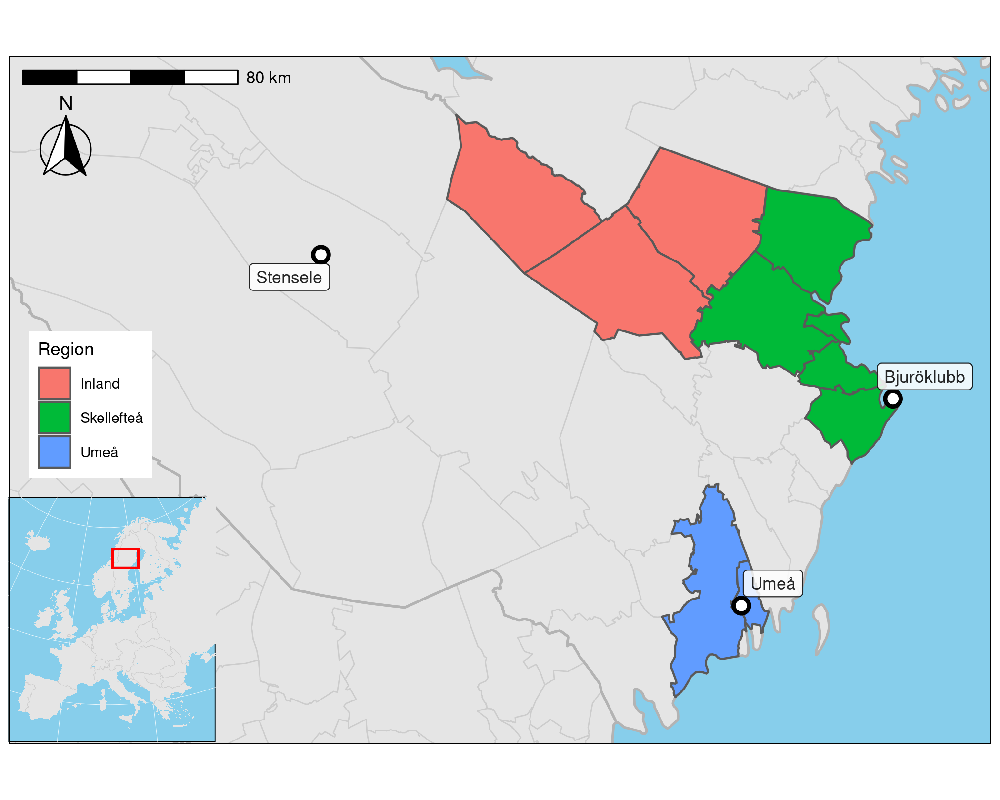

```{r setup, include=FALSE}
knitr::opts_chunk$set(echo = FALSE, fig.path='figs/',fig.height=3, comment=NA, cache= TRUE) ## NOTE!!
knitr::opts_knit$set(global.par = TRUE)
##
library(knitr)
library(eha)
starttid <- proc.time()
```

```{r setpar}
par(las = 1, cex.axis = 0.8, cex.lab = 0.8, cex = 0.8)
```

```{r readdata}
births <- readRDS("data/births4.rds")
infdat  <- readRDS("data/infdat4.rds")
```
# Introduction

The impact of ambient temperature variations on infant mortality is studied for 
a northern Sweden coastal area, the Umeå and Skellefteå regions, during the 
first half of the twentieth century. Two recent papers [@junkka; @karlsson] studied 
neonatal mortality and temperature variations in a larger geographical area containing 
the present one during the 
years 1880--1950. Climate and mortality in general is a research area that has 
generated great interest over the last years, see @tbgb10.

The effect of seasonal variation and the occurrence of extreme monthly temperatures
is studied and interacted with sex, social class, and legitimacy. Studies are performed 
separately for neonatal  and postneonatal mortality, and for winter and summer seasons, 
and the classification into endogenous and exogenous factors will be discussed.

Figure \@ref(fig:map) shows the study area within Sweden, with the weather stations 
marked. The map is taken (with permission) from the paper by @junkka.

```{r map, fig.height = 5, fig.cap = "Umeå, Skellefteå (orange) and its inland (green)."}

```


# Data

We have two sources of data which we combine into one data set suitable for our purpose.
The first is demographic data obtained from the 
*Centre for Demographic and Ageing Research* (CEDAR, https://cedar.umu.se),
the second is daily temperature measurements obtained from the 
*Swedish Meteorological and Hydrological Institute* (SMHI, https://www.smhi.se). 

## Infant mortality

Individual data with all births between 1 January 1895 and 31 December 1950 in two 
coastal and one inland areas of north Sweden, Skellefteå (51560 births) and Umeå (31213 births).
They were followed until death or age one year, whichever came first. 
The following *static* characteristics were observed on each child:

**birthdate** Date of birth. 

**sex** Girl or boy.

**exit** Number of days under observation.

**event** Logical, *TRUE* if a death is observed.

**socBranch** Working branch of father (if any).

**socStatus** Social status of family, based on HISCLASS.

**illeg** Mother unmarried?

**parity** Order among siblings.

Some crude statistics about infant, neonatal, and postneonatal mortality are shown in 
Figures.

Figure \@ref(fig:mortstat) shows the average monthly crude infant mortality, and a clear seasonal pattern is visible.

```{r mortstat, fig.cap = "Crude infant mortality by week of year, Umeå/Skellefteå 1895--1950.", fig.height = 3}
##infdat <- readRDS("data/infdat4.rds") Already done
tid <- toTpch(Surv(enter, exit, event) ~ week, data = infdat, cuts = c(0, 1))
y <- tid$event / tid$exposure
par(las = 1, cex.axis = 0.7, cex.lab = 0.7)
plot(1:52, y, type = "b", col = "blue", axes = FALSE, ylim = c(0, max(y)),
     xlab = "Week", ylab = "IMR", cex = 0.7, lwd = 1.5)
axis(1, at = c(1, 10, 20, 30, 40, 52))
axis(2, las = 1, at = c(0, 0.03, 0.06, 0.09))
abline(h = c(0.05, 0.07, 0.09, 0.11), lty = 3)
abline(h = 0)
box()
```

The average monthly neonatal mortality is shown in Figure \@ref(fig:neodata).

```{r neodata, fig.cap = "Crude neonatal mortality by week of year, Umeå/Skellefteå 1895--1950.", fig.height = 3}
neo <- age.window(infdat, c(0, 28 / 365))
tneo <- toTpch(Surv(enter, exit, event) ~ week, data = neo, cuts = c(0, 28 / 365))
y <- tneo$event / tneo$exposure
par(cex.axis = 0.7)
par(las = 1, cex.axis = 0.7, cex.lab = 0.7)
plot(1:52, y, type = "b", col = "blue", axes = FALSE, ylim = c(0, max(y)),
     xlab = "Week", ylab = "NMR", cex = 0.7, lwd = 1.5)
axis(1, at = c(1, 10, 20, 30, 40, 52))
axis(2, las = 1, at = c(0, 0.2, 0.4, 0.6))
abline(h = c(0.3, 0.4, 0.5, 0.6), lty = 3)
abline(h = 0)
box()
```

The seasonal pattern is similar to the one we found above for infant mortality.

The average monthly postneonatal mortality is shown in Figure \@ref(fig:pneodata).

```{r pneodata, fig.cap = "Crude postneonatal mortality by week of year, Umeå/Skellefteå 1895--1950.", fig.height = 3}
pneo <- age.window(infdat, c(28 / 365, 1))
tpneo <- toTpch(Surv(enter, exit, event) ~ week, data = pneo, cuts = c(28 / 365, 1))
y <- tpneo$event / tpneo$exposure
par(las = 1, cex.axis = 0.7, cex.lab = 0.7)
plot(1:52, y, type = "b", col = "blue", axes = FALSE, ylim = c(0, max(y)),
     xlab = "Week", ylab = "PNMR", cex = 0.7, lwd = 1.5)
axis(1, at = c(1, 10, 20, 30, 40, 52))
axis(2, at = c(0, 0.02, 0.04, 0.06), las = 1)
abline(h = c(0.03, 0.04, 0.05, 0.06, 0.07), lty = 3)
abline(h = 0)
box()
```

The seasonal pattern is once again similar to the one we found for infant mortality.
Next, the decline over the years in Figures \@ref(fig:longtrend) and \@ref(fig:ntrend).

```{r longtrend, fig.cap = "Crude IMR by year, Umeå-Skellefteå 1895--1950.", fig.height = 3}
trend <- toTpch(Surv(enter, exit, event) ~ year, data = infdat, cuts = c(0, 1))
y <- trend$event / trend$exposure
par(las = 1)
par(las = 1, cex.axis = 0.7, cex.lab = 0.7)
plot(1895:1951, y, type = "b", col = "blue", ylim = c(0, max(y)), xlab = "Year",
     ylab = "IMR", lwd = 1.5, cex = 0.7)
abline(h = c(0.05, 0.1, 0.15), lty = 3)
abline(h = 0)
```


```{r ntrend, fig.cap = "Crude NMR by year, Umeå-Skellefteå 1895--1950.", fig.height = 4}
ndat <- age.window(infdat, c(0, 28 / 365))
tnda <- toTpch(Surv(enter, exit, event) ~ year, data = ndat, cuts = c(0, 28 / 365))
y <- tnda$event / tnda$exposure
par(las = 1)
par(las = 1, cex.axis = 0.7, cex.lab = 0.7)
plot(1895:1951, y, type = "b", col = "blue", ylim = c(0, max(y)), xlab = "Year",
     ylab = "NMR", lwd = 1.5, cex = 0.7)
abline(h = 0)
abline(h = c(0.2, 0.4, 0.6), lty = 3)
```

## Temperature

```{r readtemp}
umetemp <- readRDS("data/umetemp.rds")
bjurtemp <- readRDS("data/bjurtemp.rds")
stentemp <- readRDS("data/stentemp.rds")
```

Temperature data are collected from three weather stations, *Umeå*, *Bjuröklubb*
(used with population data from Skellefteå coastal area), and *Stensele* (Inland). All stations deliver
daily temperature data covering our time period, usually three measures per day, morning,
noon, and evening. In Table \@ref(tab:typweek), the Umeå data from the week 1--7 January,
1923 is shown.

```{r typweek}
tum <- read.table("~/Forskning/Data/ume_temp.csv", skip = 10, sep = ";", header = TRUE)
source("R/tbl.R")
ww <- tum[70137:(70137 + 20), ]
names(ww) <- c("Date", "Time", "Temperature", "Quality")
tbl(ww, caption = "Raw temperature data from first week of 1923, Umeå.", fs = 10,
    linesep = c("", "", "\\addlinespace"))
```

There are three measurements per day, or 21 per week. In the forthcoming analyses,
the weekly data are summarized in a few measurements, see Table \@ref(tab:cond).

```{r cond}
sh <- umetemp[umetemp$year == 1923 & umetemp$week == 1, ]
tbl(round(sh[, 1:8], 2), caption = "Weekly summarized temperature data: Umeå 1923, first week.", fs = 9)
```

Weekly averages (`mintemp`, `maxtemp`, `meantemp`)  are calculated by week and year, and deviations from 
the averages (`emintemp`, `emaxtemp`, `emeantemp`) of the weekly averages are used as time-varying *communal covariates*. 
As an example, see Figure \@ref(fig:firstweek), where the variation around the average
minimum temperature (`emintemp`) week 1 is shown. 

```{r firstweek, fig.cap = "Minimum temperature the first week of each year.", fig.height = 3}
w1 <- umetemp[umetemp$week == 1, ]
emintemp <- w1$emintemp[1]
mintemp <- w1$mintemp
par(las = 1, cex.axis = 0.7, cex.lab = 0.7)
plot(w1$year, mintemp, type = "b", lty = 2, col = "blue", xlab = "Year", ylab = "Temperature", 
     axes = FALSE, ylim = c(-35, 0), cex = 0.7)
axis(1, at = c(1894, 1903, 1913, 1923, 1932, 1942, 1951))
whh <- c(-30, -25, emintemp, -10, 0) 
axis(2, at = whh, labels = round(whh))
abline(h = emintemp, lwd = 1.5, col = "blue")
abline (h = 0)
abline(v = 1923, lty = 3)
box()
```

Curiously, our randomly selected year 1923 turns out contain the warmest first week of all years, see 
Figure \@ref(fig:firstweek). 

Figure 
\@ref(fig:monavgtemp) shows the average monthly distribution over all years. The subregional patterns 
and levels are very similar.

```{r monavgtemp, fig.cap="Weekly max, mean, and min temperature averages, 1895--1950.", fig.height = 3}
oldpar <- par(mfrow = c(1, 3))
## Umeå:
umaxavg <- umetemp$emaxtemp[1:52]
uminavg <- umetemp$emintemp[1:52]
umeanavg <- umetemp$emeantemp[1:52]
##par(las = 1, cex.axis = 0.7, cex.lab = 0.7)
plot(1:52, umaxavg, ylim = c(-30, 30), type = "b", col = "red", axes = FALSE,
     xlab = "Week", ylab = "Temperature (C)", cex = 0.6, lwd = 0.7)
text(17, 27, "Umeå", cex = 0.7)
axis(1, at = c(1, 10, 29, 43, 52))
m12 <- c(-30, -15, 0, 14.5, 25)
axis(2, las = 1, at = m12)
abline(h = 0)
abline(v = 29, lty = 3)
abline(h = m12, lty = 3)
lines(1:52, uminavg, type = "b", col = "blue", cex = 0.6, lwd = 0.7)
lines(1:52, umeanavg, type = "l", col = "black", cex = 0.6, lwd = 0.8)
text(8, 11, "max", col = "red", cex = 0.7)
text(20, -9, "min", col = "blue", cex = 0.7)
box()
## Skellefteå:
bmaxavg <- bjurtemp$emaxtemp[1:52]
bminavg <- bjurtemp$emintemp[1:52]
bmeanavg <- bjurtemp$emeantemp[1:52]
plot(1:52, bmaxavg, ylim = c(-30, 30), type = "b", col = "red", axes = FALSE,
     xlab = "Week", ylab = "Temperature (C)", cex = 0.6, lwd = 0.7)
text(17, 27, "Skellefteå", cex = 0.7)
axis(1, at = c(1, 10, 29, 43, 52))
axis(2, las = 1, at = m12)
abline(h = 0)
abline(v = 29, lty = 3)
abline(h = m12, lty = 3)
lines(1:52, bminavg, type = "b", col = "blue", cex = 0.6, lwd = 0.7)
lines(1:52, bmeanavg, type = "l", col = "black", cex = 0.6, lwd = 0.8)
text(8, 11, "max", col = "red", cex = 0.7)
text(20, -9, "min", col = "blue", cex = 0.7)
box()
##
## Inland:
bmaxavg <- stentemp$emaxtemp[1:52]
bminavg <- stentemp$emintemp[1:52]
bmeanavg <- stentemp$emeantemp[1:52]
plot(1:52, bmaxavg, ylim = c(-30, 30), type = "b", col = "red", axes = FALSE,
     xlab = "Week", ylab = "Temperature (C)", cex = 0.6, lwd = 0.7)
text(17, 27, "Inland", cex = 0.7)
axis(1, at = c(1, 10, 29, 43, 52))
axis(2, las = 1, at = m12)
abline(h = 0)
abline(v = 29, lty = 3)
abline(h = m12, lty = 3)
lines(1:52, bminavg, type = "b", col = "blue", cex = 0.6, lwd = 0.7)
lines(1:52, bmeanavg, type = "l", col = "black", cex = 0.6, lwd = 0.8)
text(8, 11, "max", col = "red", cex = 0.7)
text(20, -9, "min", col = "blue", cex = 0.7)
box()
##
par(oldpar)
```

Time trends of yearly average temperatures, see Figure \@ref(fig:longterm).

```{r longterm, fig.cap = "Yearly average temperatures, Umeå and Skellefteå."}
bmtemp <- rbind(umetemp, bjurtemp, stentemp)
umt <- with(bmtemp, tapply(meantemp, year, mean))
par(las = 1)
par(las = 1, cex.axis = 0.7, cex.lab = 0.7)
plot(1894:1951, umt, type = "b", col = "blue", xlab = "Year",
     ylab = "Mean temperature", lwd = 1.5, cex = 0.7, ylim = c(0, 7))
abline(h = 0)
abline(h = 1:6, lty = 3)
```

## Temperature as communal covariates

The two data sets, mortality and weather, are combined into one by treating temperature data 
as a communal covariate and incorporate it as such in the mortality data set. The 
function *make.communal* in the **R** [@cran] package *eha* [@eha; @ehar2] is used 
for that purpose.  Resulting data drame is partly shown in Table \@ref(tab:readdata3).

```{r readdata3}
levels(infdat$subreg) <- c("ume", "ske", "inland")
##infdat$excessTemp <- cut(infdat$extemp, c(-16, -2, 2, 9), include.lowest = TRUE) # NOTE!!!
##infdat$excessTemp <- relevel(infdat$excessTemp, ref = "(-2,2]")
##infdat$lowTemp <- (infdat$extemp + infdat$extemp.1) < -10  # CHECK THIS!!
##infdat$highTemp <- infdat$extemp + infdat$extemp.1 > 10
##infdat$lowTemp <- with(infdat, (extemp < -3) & (extemp.1 < -3))
infdat$lowTemp <- (with(infdat, cold + cold.1 < -10))
infdat$highTemp <- with(infdat, (extemp > 3) & (extemp.1 > 3))
tbl(head(infdat[, c("enter", "exit", "event", "lowTemp", "highTemp", "extemp", "emeantemp", "week", "year")]),
    caption = "Data with communal covariates.", fs = 9)
```


# Statistical modelling

It turns out that extremely low temperature (`lowTemp`) is bad during all seasons except summer,
and extremely high temperature (`highTemp`) is bad during summer, but good otherwise.
So we group season into two categories, *summer* and *not summer*.
In each case separate analyses for neonatal and postneonatal mortality are performed. 

The *summer* half-year is the weeks 14--39, about 1 April to 30 September, and the *winter*
half-year is the rest, weeks 1-13 and 40--52, 1 January to 31 March and 1 October to 31 December.
This is the division made in @karlsson, and we keep it for comparability reasons.

```{r prepare}
source("R/ltx2.R")
infdat$parity <- cut(infdat$parity, c(-2, 1.5, 4.5, 19), labels = c("1", "2-4", "5+"))
##infdat$period <- cut(infdat$birthdate, c(1895, 1914, 1935, 1951), dig.lab = 5)
##levels(infdat$subreg) <- c("ume", "ske")
##infdat$season <- cut(infdat$week, c(-1, 9.5, 22.5, 35.5, 48.5, 52.5), labels = c("winter", "spring", "summer", "fall", "winter"))
##infdat$season <- as.factor(infdat$season)
## New:
infdat$summer <- infdat$week %in% 14:39
infdat$emeantemp <- round(infdat$emeantemp)
levels(infdat$socBranch) <- c("office", "farming", "none", "office", "worker") # NOTE!
```

# Results

The results regarding neonatal mortality is much in accordance with the results
found by @junkka. However, they used temperature in a "hockey-stick" regression with a breakpoint at
14.5 degrees Celsius and a negative slope (decreasing risk) to the left and a positive slope
(increasing risk) to the right. Instead, we are using the average weekly temperature
for the 52 weeks of a year, for each week averaging over all the years in the study, as
our "reference points" ("climate"), adding deviances up and down ("weather") as
"short-term temperature stress". This is similar to the way prices and mortality were related
in for instance @genus11, that is, a time series split into long time trend and short
term variation.

Comments on other candidate covariates: 

*Birth month* is left out in the analyses despite that fact that
it is an important factor in neonatal mortality. However, we include *time of year* in terms of 
*winter* and *summer* as a time-varying covariate, and in the neonatal case it will coincide to a
great extent with birth period. For the postneonal case the situation is different, but it turns out that
for those infants who have survived the first month of life, birth month does not matter much.
We separate the investigation into two parts, *neonatal* and *postneonatal* mortality. But first,
a joint analysis.

*Socioeconomic status* is divided into two factor covariates: *socBranch* and *socStatus*. The latter should be 
seen relative to actual *socBranch*. We have information on whether the infant was *illegitimate* (mother unmarried),
but we incorporate those cases in the category *none* of *socBranch* and *unknown* as category of *socStatus*.


```{r managedata}
library(survival)
neo <- age.window(infdat, c(0, 28 / 365))
neo$ageIvl <- "neo"
pneo <- age.window(infdat, c(28/365, 1))
pneo$ageIvl <- "postneo"
all <- rbind(neo, pneo)
all$ageIvl <- factor(all$ageIvl)
##all$enter <- round(all$enter * 365)
##all$exit <- round(all$exit * 365)
##fit.all <- coxph(Surv(enter, exit, event) ~ strata(ageIvl) * (extemp + emeantemp + lowTemp + highTemp + socBranch + ##socStatus + sex + period),
  ##               data = all)
##dr.all <- drop1(fit.all, test = "Chisq")

inftab <- toTpch(Surv(enter, exit, event) ~ subreg + sex + period + socBranch + socStatus + parity + 
                     extemp + emeantemp + lowTemp + highTemp + summer + ageIvl, data = all,
                 cuts = c(0, 3, 7, 14, 28, 56, 84, 145, 207, 286, 365) / 365)
tabneo <- inftab[inftab$ageIvl == "neo", ]
tabpost <- inftab[inftab$ageIvl == "postneo", ]
tabpost$age <- factor(tabpost$age)
tabneo$age <- factor(tabneo$age)
```

```{r joint}
fit.all <- tpchreg(oe(event, exposure) ~  strata(ageIvl) * 
                       (extemp + emeantemp + lowTemp + highTemp + socBranch + period), 
                   data = inftab, time = age)
dr.all <- drop1(fit.all, test = "Chisq")
##system.time(tabneo.fit <- tpchreg(oe(event, exposure) ~ extemp + emeantemp + highTemp + lowTemp + socBranch + socStatus, 
  ##               data = tabneo, time = age))
##system.time(tabpost.fit <- tpchreg(oe(event, exposure) ~ extemp + emeantemp + highTemp + lowTemp + socBranch + socStatus, 
  ##               data = tabpost, time = age))
```


```{r shownonprop, cache = FALSE}
tbl(round(dr.all, 4), caption = "Proportionality tests, neonatal vs. postneonatal.", rownames = TRUE)
```

From Table \@ref(tab:shownonprop) we can see that the variables *emeantemp*, *lowTemp*, *socStatus* and *period* all have different effects on mortality in the neonatal case compared to the postneonatal case. In terms of 
*infant mortality*, we can say that these caovariates have non-proportional effects. As an example, see Figure  


## Neonatal mortality


The analyses are split into two parts by season, *winter* is one, and *summer* the other.
Summer covers the months April to September, and winter the rest of the months.

```{r formneo}
formneo <- as.formula("oe(event, exposure) ~  lowTemp + highTemp + extemp + emeantemp + socBranch + period +
                     subreg + sex + parity")
```

### Winter

This period refers to the months *October to March*. A Cox regression involves as
interesting variables *highTemp*, an indicator of temperature at least four degrees
above the expected for at least two weeks in a row, *emeantemp* the expected temperature
the actual weeek, and *extemp* the *excess temperature* the actual week.


```{r neoanalwp, results = 'asis'}
##library(survival)
winter <- tabneo[!tabneo$summer, ]
##winter$season <- factor(winter$season)
##neo$exit <- g(neo$exit * 365) # Skip the log-cube transformation
##neo$enter <- g(neo$enter * 365)
fit.neow <- tpchreg(formneo, data = winter, time = age)
dr <- drop1(fit.neow, test = "Chisq")
```

```{r neoanalw, results = "asis", cache = FALSE}
ltx2(fit.neow, dr = dr, caption = "Neonatal mortality, October to March. Adjusted for social branch, sex, illegitimacy, parity, time period, and subregion.", 
     label = "tab:neoanalw", keep = NULL)
```

### Summer

This period refers to the months *April to September*. A Cox regression involves as
interesting variables *highTemp*, an indicator of temperature at least four degrees
above the expected for at least two weeks in a row, *emeantemp* the expected temperature
the actual weeek, and *extemp* the *excess temperature* the actual week.


```{r neoanalsp}
##library(survival)
#summer <- neo[neo$summer, ]
##summer$season <- factor(summer$season)
##neo$exit <- g(neo$exit * 365) # Skip the log-cube transformation
##neo$enter <- g(neo$enter * 365)
fit.neos <- tpchreg(formneo, data = tabneo[tabneo$summer, ], time = age)
dr.neos <- drop1(fit.neos, test = "Chisq")
```

```{r neoanals, results = 'asis', cache = FALSE}
ltx2(fit.neos, dr = dr.neos, caption = "Neonatal mortality, April to September. Adjusted for social branch, sex, illegitimacy, parity, time period, and subregion.", 
     label = "tab:neoanals", keep = NULL)
```


## Postneonatal mortality


### Winter


```{r postanalwp, results='asis'}
##tpneo <- toTpch(Surv(enter, exit, event) ~ lowTemp + highTemp + extemp + emeantemp + sex + socBranch + illeg + parity
  ##              + subreg + period, data = infdat, cuts = c(0, 1))
##winter <- gtpneo[gtpneo$summer == 0, ]
##winter$season <- factor(winter$season)

fit.postw <- tpchreg(oe(event, exposure) ~ period * (lowTemp + highTemp + extemp + emeantemp), 
                     data = tabpost[!tabpost$summer, ], time = age)
dr.postw <- drop1(fit.postw, test = "Chisq")
```

```{r postanalw, results='asis', cache = FALSE}
tbl(round(dr.postw, 4), caption = "Interaction tests with temperature and period, postneonatal mortality.", rownames = TRUE)
##ltx2(fit.tpch, dr = dr, caption = "Postneonatal mortality, October to March. Adjusted for social branch, sex, ##illegitimacy, parity, time period, and subregion.", label = "tab:postanalw", keep = NULL)
```

The result in Table \@ref(tab:postanalw) shows that the temperature effects vary with time period,
so we continue with seaparate analyses for the time periods `r levels(tabpost$period)`.

```{r setformw}
form <- as.formula("oe(event, exposure) ~ lowTemp + highTemp + extemp + emeantemp + socStatus + subreg + sex + parity")
```


#### The time period 1895--1913

```{r postw1p, results = "asis"}
fit.postw1 <- tpchreg(form, data = tabpost[(!tabpost$summer) & tabpost$period == "(1895,1914]", ], time = age)
dr.postw1 <- drop1(fit.postw1, test = "Chisq")
```

```{r postw1, results = "asis", cache = FALSE}
ltx2(fit.postw1, dr = dr.postw1, caption = "Postneonatal mortality, October to March 1895-1914. Adjusted for social branch, sex, illegitimacy, parity, and subregion.", label = "tab:postw1", keep = NULL)
```

Table \@ref(tab:postw1) shows that

#### The time period 1914--1934

```{r postw2p, results = "asis"}
fit.postw2 <- tpchreg(form, data = tabpost[(!tabpost$summer) & tabpost$period == "(1914,1935]", ], time = age)
dr.postw2 <- drop1(fit.postw2, test = "Chisq")
```

```{r postw2, results = "asis", cache = FALSE}
ltx2(fit.postw2, dr = dr.postw2, caption = "Postneonatal mortality, October to March 1914-1934. Adjusted for social branch, sex, illegitimacy, parity, and subregion.", label = "tab:postw2", keep = NULL)
```

Table \@ref(tab:postw2) shows that

#### The time period 1935--1950

```{r postw3p, results = "asis"}
fit.postw3 <- tpchreg(form, data = tabpost[(!tabpost$summer) & tabpost$period == "(1935,1951]", ], time = age)
dr.postw3 <- drop1(fit.postw3, test = "Chisq")
```

```{r postw3, results = "asis", cache = FALSE}
ltx2(fit.postw3, dr = dr.postw3, caption = "Postneonatal mortality, October to March 1935-1950. Adjusted for social branch, sex, illegitimacy, parity, and subregion.", label = "tab:postw3", keep = NULL)
```

Table \@ref(tab:postw3) shows that


### Summer


```{r postanalsp, results='asis'}
##summer <- gtpneo[gtpneo$summer == 1, ]
##winter$season <- factor(winter$season)

fit.posts <- tpchreg(oe(event, exposure) ~ lowTemp + highTemp + extemp + emeantemp + socBranch + period + 
                        subreg + parity + sex, 
                    data = tabpost[tabpost$summer, ], time = age)
dr <- drop1(fit.posts, test = "Chisq")
```


```{r postanals, results='asis', cache = FALSE}
ltx2(fit.posts, dr = dr, caption = "Postneonatal mortality, April to September. Adjusted for social branch, sex, illegitimacy, parity, time period, and subregion.", label = "tab:postanals", keep = NULL)
```

The result in Table \@ref(tab:postanals) shows that *climate* (`emintemp`) is more important than 
*weather* (`excessTemp`). Moreover, no signs of interaction between weather or climate and the rest of 
covariates (not shown).


# Conclusion

Remains to be written, especially the discussion about temperature and mortality. 

Used processing time (seconds):

```{r tidtagning}
sluttid <- Sys.time()
proc.time() - starttid
```


Done: `r sluttid`.
